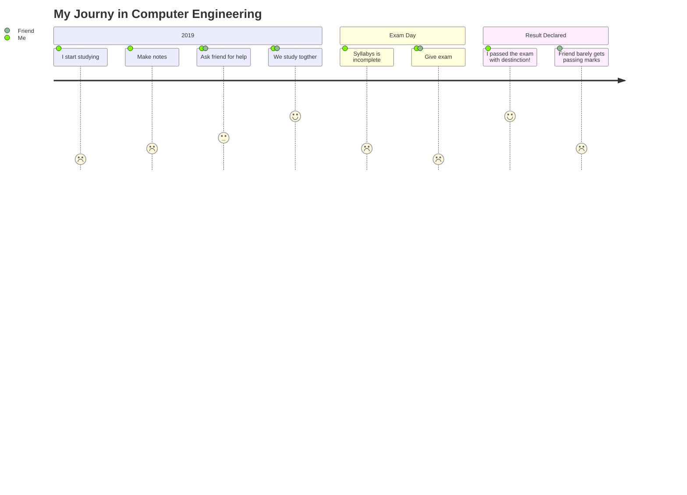

### Hi there 👋

- 🔭 I’m currently working on django
- 🌱 I’m currently learning django
- 👯 I’m looking to collaborate on java 
- 🤔 I’m looking for help with distributed systems and software architecture

